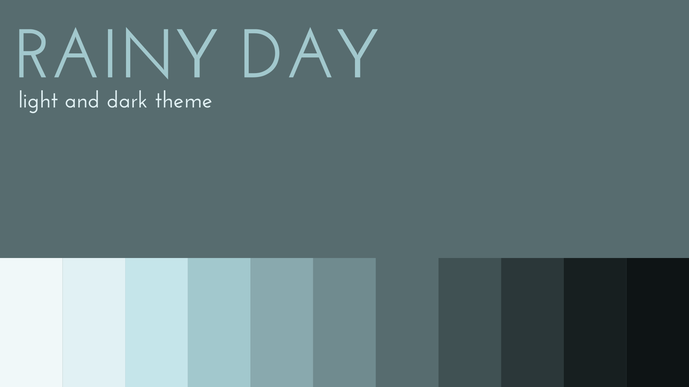
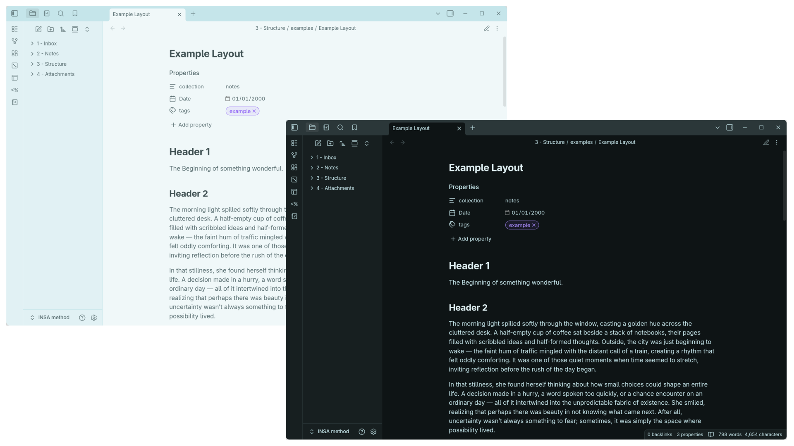

Rainy Day is a color palette I had created for a project back in 2018 for a [keycap set](https://cannonkeys.com/products/gmk-rainy-day-r2?_pos=1&_sid=1631cf6cf&_ss=r) that could be used on mechanical keyboards. The theme consisted of 2 gray tones that leaned blue and a desaturated pale blue with an ever-so-slight hint of green. These colors were chosen to illicit a melancholic and cold feeling. The set was inspired by a series of rainy days I experienced in Colorado near very concrete and brutalist architecture. 

